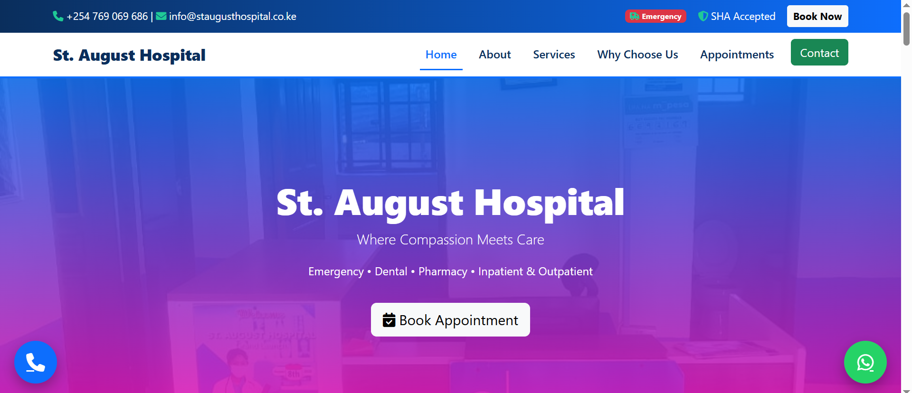
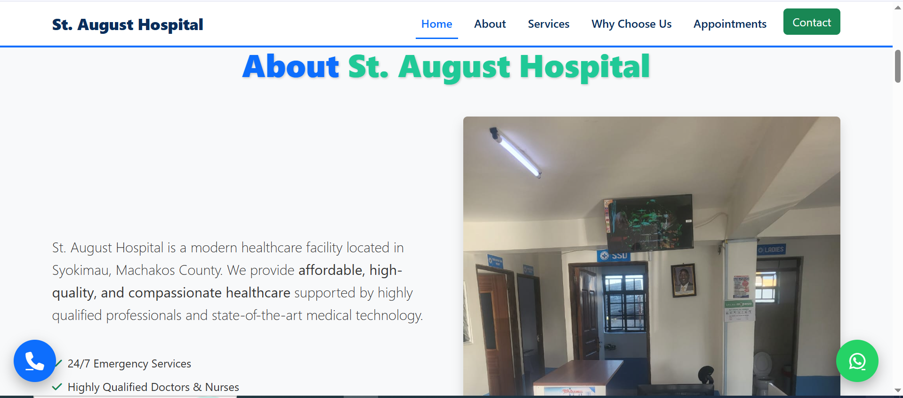
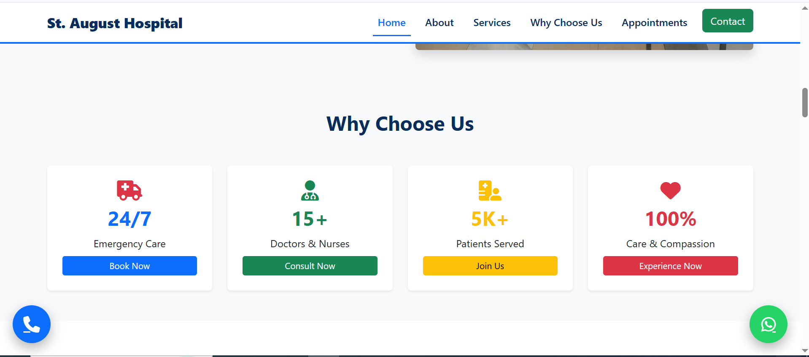
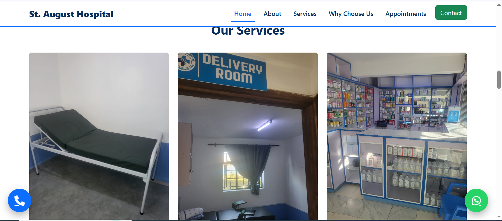

# St. August Hospital Website

**Where Compassion Meets Care**

---

## Table of Contents

- [St. August Hospital Website](#st-august-hospital-website)
  - [Table of Contents](#table-of-contents)
  - [Project Overview](#project-overview)
  - [Features](#features)
  - [Technologies Used](#technologies-used)
  - [Pages](#pages)
  - [](#)
  - [Installation \& Usage](#installation--usage)

---

## Project Overview

This is the official website for **St. August Hospital**, a modern healthcare facility located in Syokimau, Machakos County along Katani Road near 360 Degrees Court Apartment Phase 1.  

The website is fully **responsive**, mobile-friendly, and professionally designed to showcase the hospital’s services, facilities, and allow patients to easily book appointments.  

---

## Features

- **Top Bar:** Contact information, SHA coverage badge, emergency badge, and "Book Now" button.  
- **Responsive Navbar:** Links to Home, About, Services, Appointments, and Contact sections.  
- **Hero Section:** Attractive background image, tagline, and call-to-action button.  
- **About Section:** Modern layout with image on the right, text on the left, and key features highlighted.  
- **Trust Stats:** Displays important statistics about emergency care, staff, patients served, and quality.  
- **Facilities:** Showcases hospital facilities like wards, delivery room, and ample parking.  
- **Why Choose Us:** Highlighting qualified doctors, modern facilities, and secure parking.  
- **Services:** Cards displaying all hospital services including Inpatient, Dental, Pharmacy, and more.  
- **CTA Section:** Encourages visitors to book appointments easily.  
- **Appointments Form:** Collects visitor name, email, phone, service selection, and preferred date.  
- **Contact Section:** Address, phone, email, and interactive Google Map embedded.  
- **Floating Buttons:** WhatsApp and Call buttons for instant communication.  
- **Footer:** Dynamic current year, professional branding, developed by **DantechDevelopers**.  

---

## Technologies Used

- HTML5 & CSS3  
- Bootstrap 5.3  
- Font Awesome 6  
- Google Maps Embed  
- Optional SEO meta tags  
- Responsive design for phones, tablets, and desktops  

---

## Pages

All content is currently contained in a **single-page layout** with internal navigation:

- **Home**  
- **About**  
- **Why Choose Us**  
- **Services**  
- **Appointments**  
- **Contact**  

> Each section is linked via the navbar and top bar buttons for easy scrolling.  




---

## Installation & Usage

1. Clone the repository:

```bash
git clone https://github.com/Dantechdevs/StAugustHospitalWebsite.git
